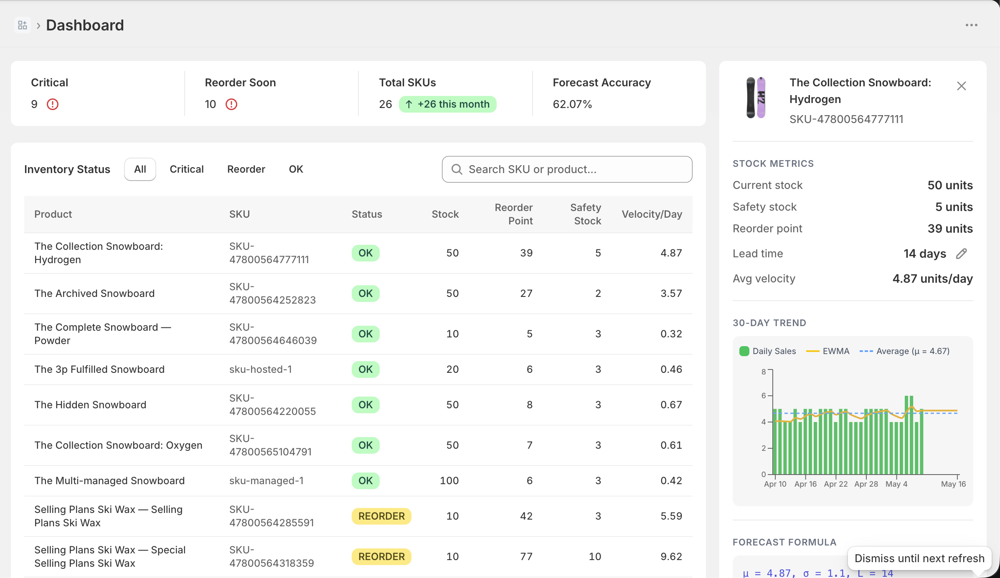
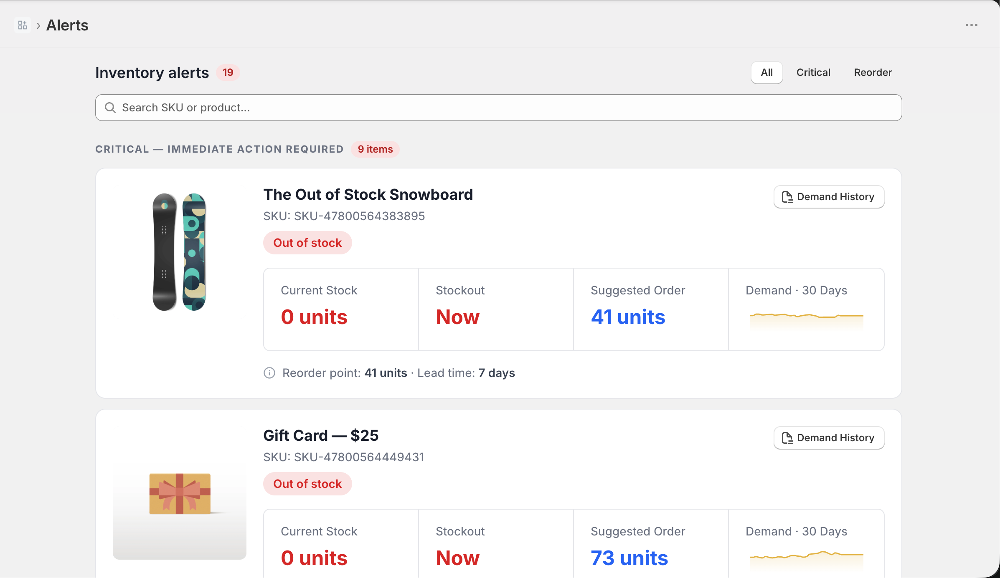

# StockSense

A Shopify app that prevents stockouts through statistical inventory forecasting. StockSense analyzes your sales history using EWMA (Exponentially Weighted Moving Average) to calculate real-time sales velocity, safety stock, and reorder points for every SKU — then surfaces actionable alerts before you run out.




## Features

- **Dashboard** — Inventory table with live status badges (OK / REORDER / CRITICAL), quick stats summary, and a product detail panel with velocity history charts
- **Alerts** — Dedicated view of all CRITICAL and REORDER SKUs with search and pagination
- **Per-product lead times** — Override the default supplier lead time on individual variants
- **Suggested order quantity** — Each alert recommends how many units to reorder using an (s, S) order-up-to policy that covers lead time + a configurable review period
- **Settings** — Tune EWMA smoothing factor (α), service level z-score, default lead time, and review period to match your business
- **Email alerts** — Opt-in email notifications when SKUs cross critical or reorder thresholds
- **How it works** — In-app explanation of the forecasting model

## How the forecasting works

StockSense runs a three-step pipeline per SKU:

| Step | Formula | Output |
|------|---------|--------|
| Sales velocity | `V_t = α·S_t + (1-α)·V_{t-1}` | units/day |
| Reorder point | `ROP = V·L + Z·σ·√L` | units |
| Status | `stock ≤ SS → CRITICAL`, `stock ≤ ROP → REORDER` | — |
| Suggested order | `Q = max(0, V·(L+R) + SS − stock)` | units |

**Defaults:** α = 0.3 · Z = 1.645 (95% service level) · R = 30 days (review period). See [`docs/stocksense-concepts.md`](docs/stocksense-concepts.md) for the full mathematical reference.

## Tech stack

- [React Router v7](https://reactrouter.com/) (full-stack, SSR)
- [Shopify App React Router](https://shopify.dev/docs/api/shopify-app-react-router) — auth, session, webhooks
- [Prisma](https://www.prisma.io/) + SQLite (session storage)
- [Tailwind CSS v4](https://tailwindcss.com/) + Polaris Web Components
- [Recharts](https://recharts.org/) — velocity history charts
- [i18next](https://www.i18next.com/) — internationalization
- TypeScript, Vite

## Prerequisites

- Node.js `>=20.19 <22` or `>=22.12`
- [Shopify CLI](https://shopify.dev/docs/apps/tools/cli/getting-started)
- pnpm

## Local development

```shell
pnpm install
pnpm run setup      # generate Prisma client + run migrations
shopify app dev --tunnel-url=https://huyngo248-dev.org:3000
```

Press `P` to open the app URL in your browser. Install it on a development store to start working.

## Build

```shell
pnpm run build
```

## Deploy

```shell
pnpm run deploy
```

Or use the custom deploy script:

```shell
pnpm run shopify:deploy
```

## Environment variables

| Variable | Description |
|----------|-------------|
| `SHOPIFY_API_KEY` | App API key from the Partner Dashboard |
| `SHOPIFY_API_SECRET` | App secret key |
| `SCOPES` | Required OAuth scopes |
| `NODE_ENV` | Set to `production` for deployed environments |

## Database

Session data is stored in SQLite via Prisma. For production with multiple instances, swap the datasource in `prisma/schema.prisma` to PostgreSQL or MySQL and update the session storage adapter accordingly.

If you hit `The table 'main.Session' does not exist`, run:

```shell
pnpm run setup
```

## Troubleshooting

**Embedded navigation breaks** — Use `Link` from `react-router` and `redirect` from `authenticate.admin`, not bare `<a>` tags or React Router's `redirect`.

**Webhooks not updating** — Declare app-specific webhooks in `shopify.app.toml` and run `deploy` to sync. Avoid `afterAuth` for webhook registration.

**Clock skew / "nbf" JWT error** — Enable "Set time and date automatically" in your system's Date & Time settings.

## Resources

- [StockSense forecasting concepts](docs/stocksense-concepts.md)
- [Shopify App React Router docs](https://shopify.dev/docs/api/shopify-app-react-router)
- [React Router docs](https://reactrouter.com/home)
- [Shopify CLI](https://shopify.dev/docs/apps/tools/cli)
